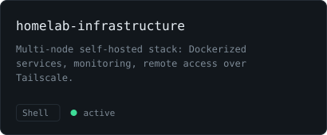
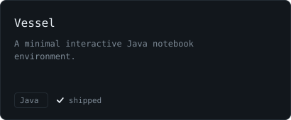
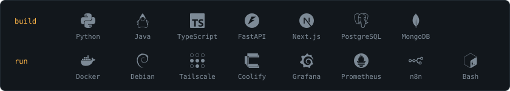
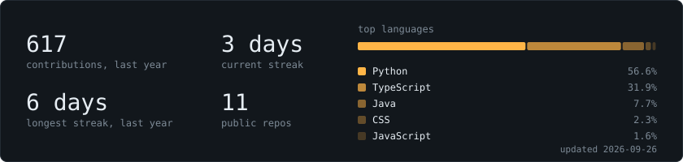

  

CS student at BITS Pilani Dubai. I build self-hosted infrastructure, backend services, and the automation that ties them together.

## `> ls projects/`

  
  

## `> cat focus.log`

- Scaling self-hosted infrastructure
- Secure remote access: VPNs, tunnels, reverse proxies
- CI/CD and deployment workflows
- Integrating AI systems into real apps

## `> ping me`

[prathlabs.com](https://prathlabs.com)
<!-- email: add once the public address is chosen -->
