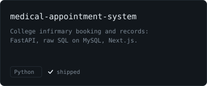
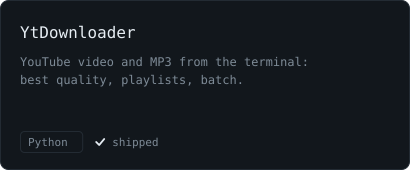

  

CS student at BITS Pilani Dubai. I build self-hosted infrastructure, backend services, and the automation that ties them together.

## `> ls projects/`

  
  
  
  

## `> cat experience.log`

- **Software development and automation**, Inter Event Management Services, Delhi (Jun to Jul 2026): built IEMS ONE, the company's ERP (FastAPI, Celery, Postgres, Redis, MinIO, Streamlit, Docker behind Caddy), and redesigned the company website.

## `> cat focus.log`

- Scaling self-hosted infrastructure
- Secure remote access: VPNs, tunnels, reverse proxies
- CI/CD and deployment workflows
- Integrating AI systems into real apps

## `> ping me`

- site: [prathlabs.vercel.app](https://prathlabs.vercel.app), a man page with a command prompt (press `:`)
- mail: [pn.prathamnagpal@gmail.com](mailto:pn.prathamnagpal@gmail.com), usually replying within 24 to 48 hours
